<div align="center">

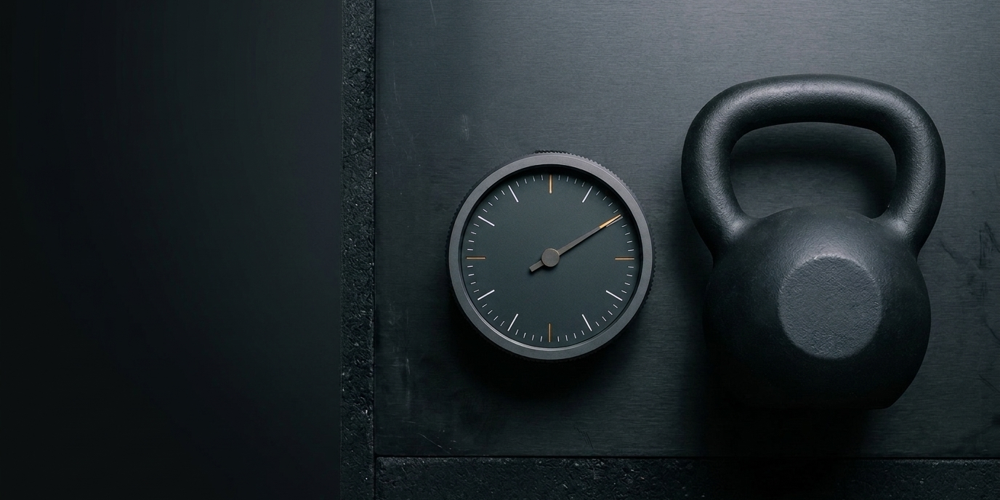

# ⏱️ Interval

**An offline-first, privacy-focused training companion for interval conditioning, kettlebell & strength training, guided mobility flows, and weekly planning.**  
Built with **Compose Multiplatform** for **Android** and **iOS**, powered by the **Kotlin Toolchain** (Amper-based). A desktop (JVM) host is kept for development only: Compose Hot Reload and UI checks.

[](https://kotlinlang.org/docs/multiplatform.html)
[](https://www.jetbrains.com/lp/compose-multiplatform/)
[-0095D5)](https://kotlin-toolchain.org/0.14/)
[](#prerequisites)
[](#-privacy-first--offline)
[](LICENSE)

<br/>

<p align="center">
  <a href="https://smithjustinn84-netizen.github.io/interval/">Documentation site</a> •
  <a href="#-app-showcase">App Showcase</a> •
  <a href="#-features">Features</a> •
  <a href="#-architecture--tech-stack">Architecture</a> •
  <a href="#-getting-started">Getting Started</a> •
  <a href="#-testing">Testing</a> •
  <a href="#-documentation">Docs</a>
</p>

</div>

---

## 📱 App Showcase

<p align="center">
  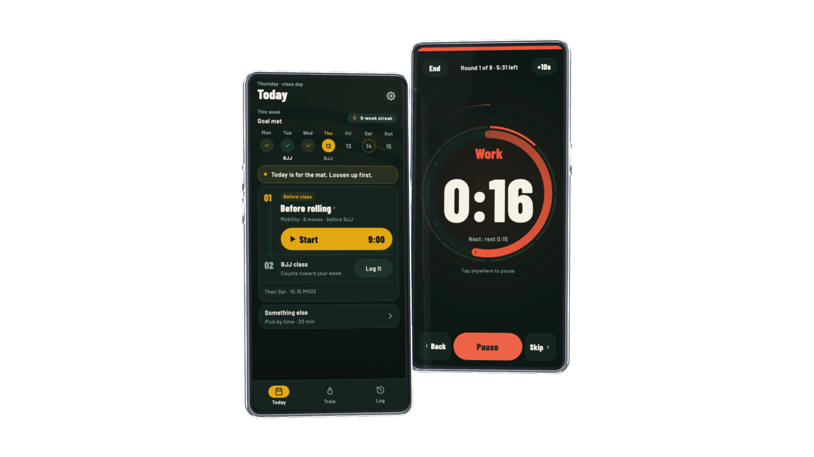
  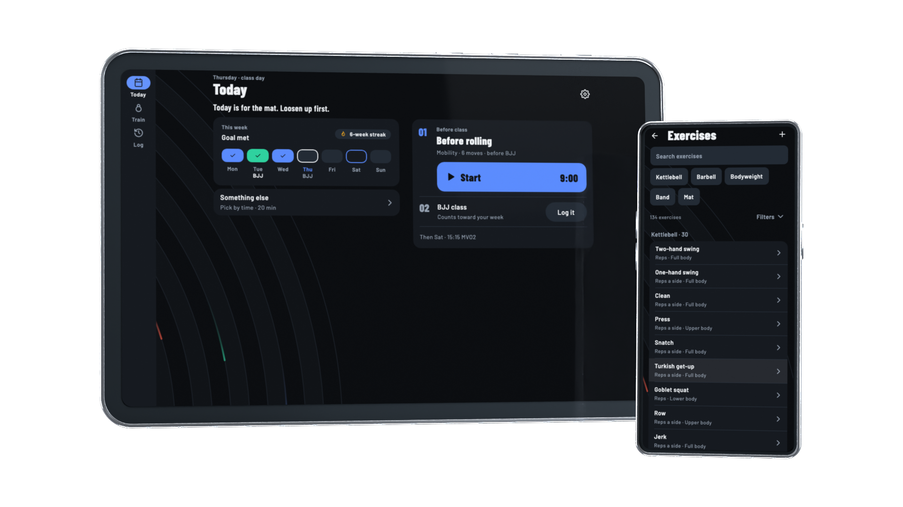
</p>

### 🧭 Today & Set up

| Today | Set up | Log: this week | Log: the month |
|:---:|:---:|:---:|:---:|
| 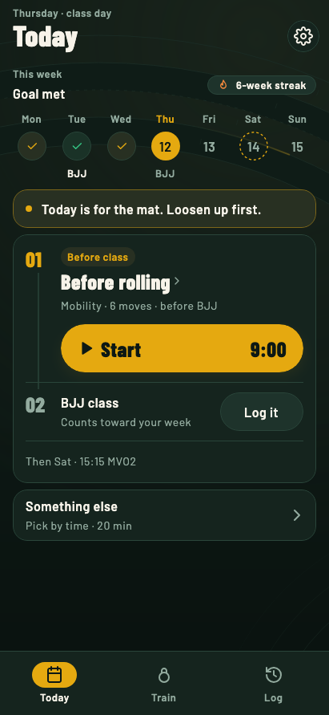 | 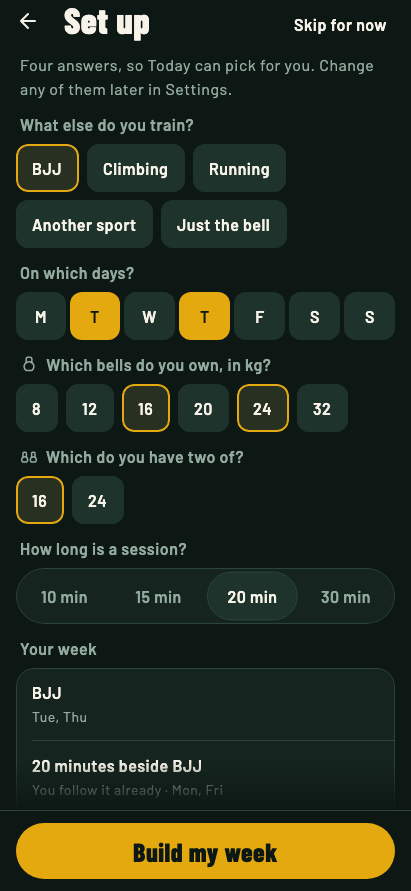 | 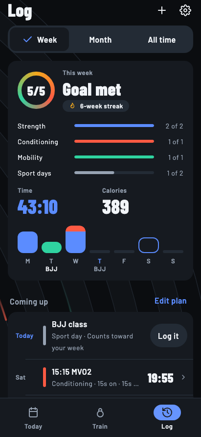 | 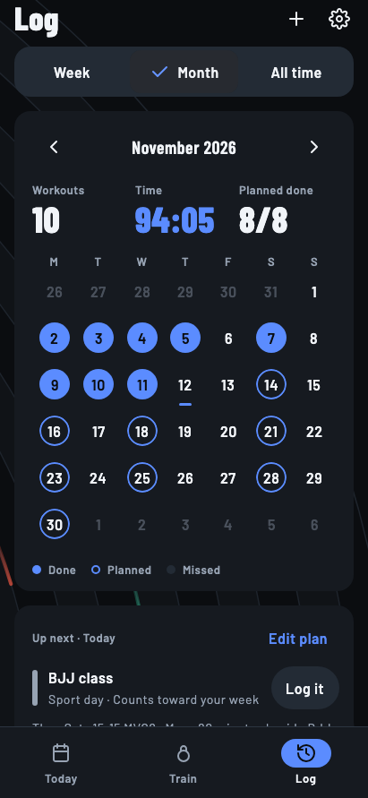 |
| *The week against the goal, the flow to do before class, the class to log, and picks that fit the minutes you have* | *A few answers (your sport and its days, what you train with, your bells or bar, a session's length) build the week* | *Each kind done against its plan, time and calories, then what is coming up* | *A calendar of done, planned and missed days* |

### 🏋️ Train: Strength, Conditioning & Mobility

| Strength | Conditioning | Mobility | A flow before Start |
|:---:|:---:|:---:|:---:|
| 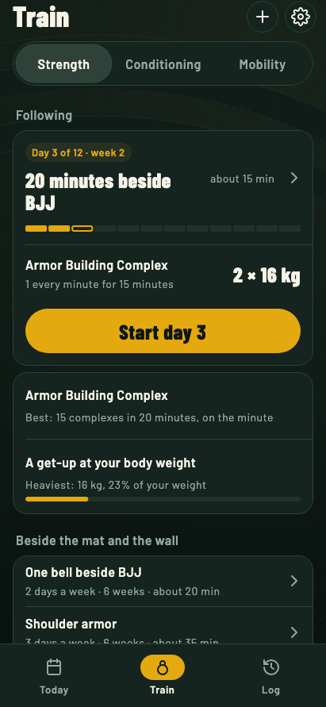 | 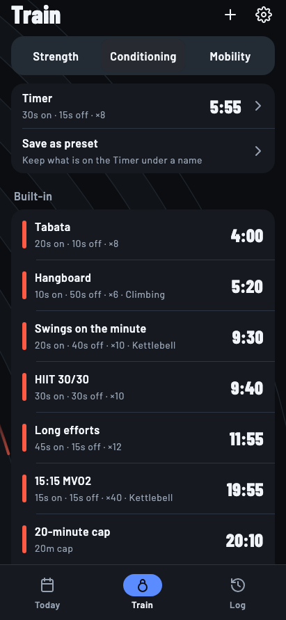 | 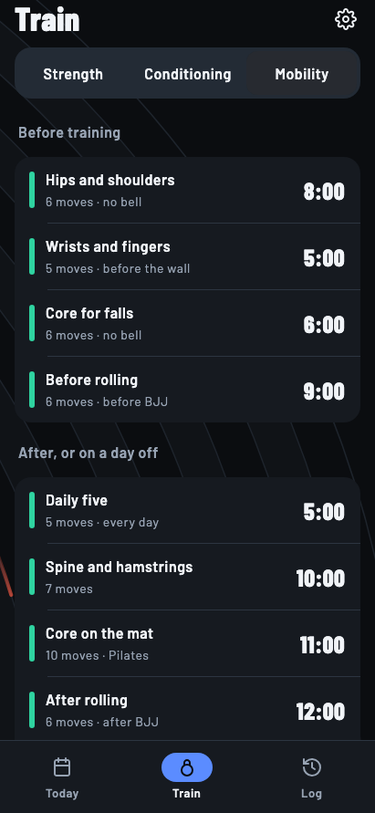 | 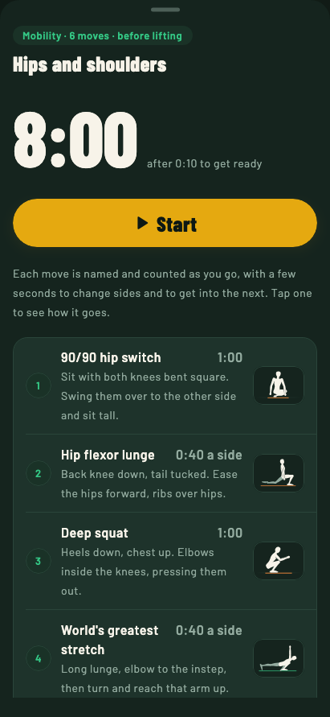 |
| *The program you follow, its day and its bells, the challenges, and programs for beside the mat* | *The Timer and the presets, shortest first* | *Flows for before training and after, and your own* | *Every move with its time and how it is done* |

### ⏱️ The Timer, the workout & Lift's session

| The Timer | A time cap | The running workout | The summary |
|:---:|:---:|:---:|:---:|
| 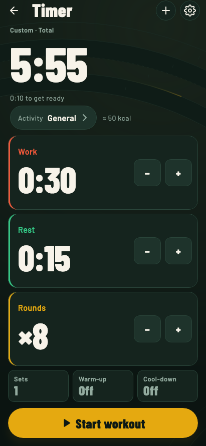 | 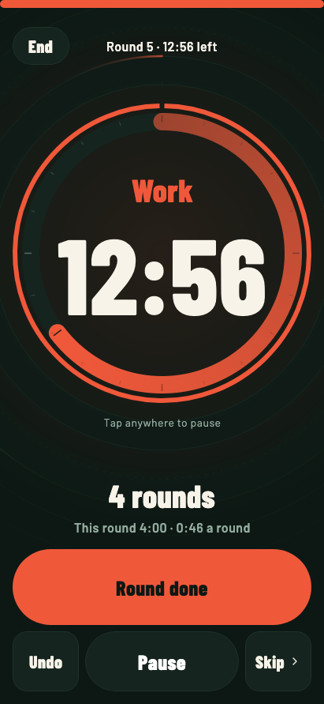 | 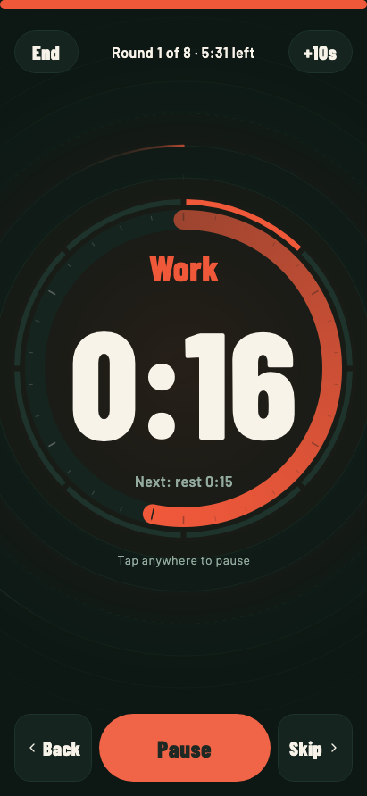 | 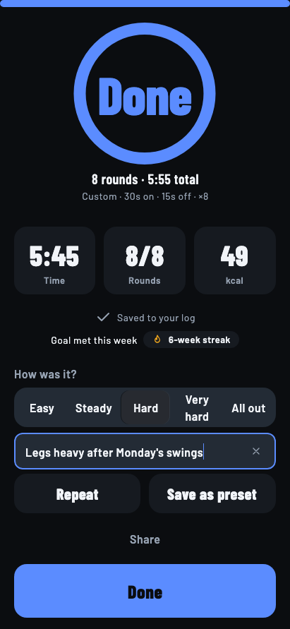 |
| *Work, rest, rounds, sets, warm-up and cool-down, with the total and a calorie estimate* | *As many rounds as you can: tap Round done, with the pace of the round under way* | *The phase, the clock, the round and what comes next* | *Time, rounds and calories, then "How was it?" and a note* |

| Lift: an EMOM running | Exercise library | A lift drawn with its bell's path | Tablet |
|:---:|:---:|:---:|:---:|
| 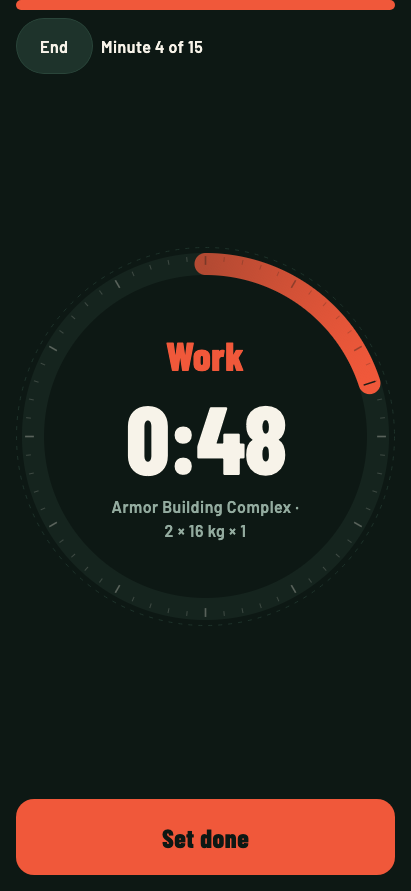 | 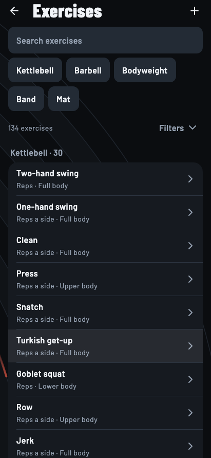 | 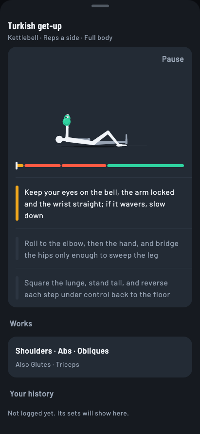 | 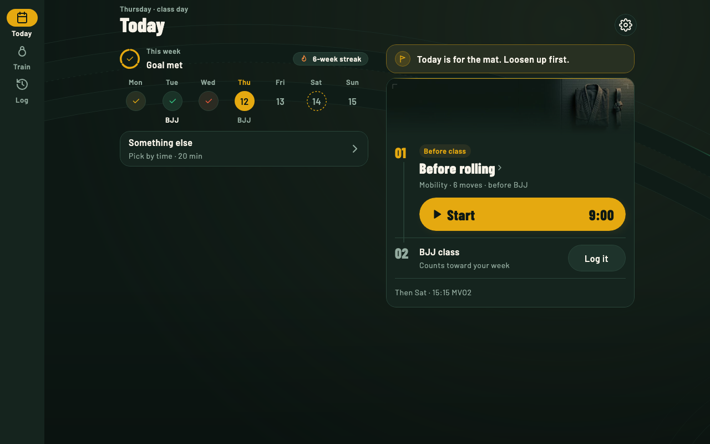 |
| *The Armor Building Complex, a pair of bells every minute* | *134 lifts across kettlebell, barbell, bodyweight, band and mat* | *A rep animated beside its cues, step by step* | *A navigation rail and two columns on a wide window* |

---

## ✨ Features

### 🧭 Guided Setup, `Today` · `Train` · `Log`
- **Track & Chalk Design**: Deep pine dark mode, warm chalk light mode, varsity gold accents, GPU shader-rendered chronograph countdown rings, zone-banded heart-rate charts, interval waveforms on preset and flow cards, and a rendered 3D kettlebell app icon.
- **Welcome**: A fresh install opens, once, on what the app is and an illustrated page each for Today, Train and Log, every one skippable, on the way to Set up. Today then carries a **First week** card — build the week, do the first workout, follow a flow, log a day of your sport — ticked as each is done, until you hide it.
- **First-Run Week Setup (`Set up`)**: Where the welcome ends on a fresh install (and anytime from Today or Settings). Answer a few questions — what else you train (BJJ, climbing, running, a custom sport, or nothing else), on which days, what you train with (kettlebells, with which bells you own in kg or lb and which you have two of; a barbell; bands; a pull-up bar; bodyweight; or conditioning only), and your session length — to pick a program your equipment and time are enough for (with bells, suited to BJJ, climbing or running; with conditioning only, conditioning presets instead), spread its days evenly around your sport with a rest day, save your equipment, and set your weekly goal. With a pair of bells and BJJ it builds a grappler's week: *20 minutes beside BJJ*, plus 15:15 MVO2 on a free day when the mat takes two days or fewer.
- **`Today` Home Tab**: Opens directly to this week's progress against your goal, a coach's line on what kind of day it is, then **the day in order** on one card (today's planned workout, pre-class mobility flow, the class to log, or your followed program's next day with estimated duration): what is done ticked off, the step to do now under one Start button, strength on a class day behind **"If there is time"**, **"Done for today"** once nothing is left, a **rest day** when nothing was asked, an **easier day** offered after a very hard session or a heavy week on the grip, and **"Or pick by time"** behind "Something else" (the program's next day when it fits, then presets and mobility flows that fit 5, 10, 15, 20, or 30 minutes). Every pick opens a look at what it is before Start, with "Plan for later" beside it.
- **Three-Pillar `Train` Tab**: One tab organized into three pillars — **Strength** (programs, muscle balance, exercises, equipment), **Conditioning** (interval presets, with the precision Timer a page over them), and **Mobility** (guided follow-along flows) — remembering the pillar you last trained on.

### ⏱️ Conditioning & Precision Interval Timer
- **Sets, Ladders & Multi-Block Sequences**:
  - **Sets of Rounds**: Group rounds into sets with dedicated rest between sets (e.g., `4 × (8 × 20/10)` with `1:00` between sets).
  - **Climbing & Falling Ladders**: Step work up or down each round (`+10s` or `-5s` a round), resetting each set.
  - **Multi-Block Sequences**: Chain multiple blocks back-to-back — each with its own work, rest, rounds, sets, and ladder, plus rest between blocks — built in the visual block editor or straight from the Timer.
  - **Time Caps**: As many rounds as you can in so many minutes, on the Timer or as any block of a sequence. Tap **Round done** as each round ends to see the rounds roll up, the pace of the round under way beside the average, and the best of the same workout; the summary and the Log keep every round's time.
- **Warm-Up & Cool-Down**: Optional warm-up before rounds and cool-down stretch after, configured on the Timer or in presets.
- **Built-in & Custom Presets**: built-in protocols (*Tabata*, *HIIT 30/30*, *Hangboard*, *Long efforts*, *Swings on the minute*, *Mat rounds*, Kenneth Jay's *15:15 MVO2* kettlebell snatch protocol, and a *20-minute cap*) alongside your own single-block presets and sequences, each previewed with an interval waveform and grouped by where it fits. A kettlebell preset can call every work after the first "Switch hands. Work" (15:15 MVO2 does), and asks on its summary about how many snatches a set, which Lift counts with its own sets.
- **Audio & Haptic Cues**: High-contrast audible beeps, spoken cues via system text-to-speech (including set numbers, block transitions, and rest between sets/blocks), halfway warnings, and vibration pulses, with `< Back`, `Pause`, `Skip >`, and `+10s` controls during workouts.
- **Live Updates, Live Activities & Background Persistence**: On Android 16, running workouts and Lift's timers show as status-bar chips with real-time countdowns and per-round, per-set, or per-block progress on the lock screen, from a foreground service with Pause/End controls. On iOS they are Live Activities on the Lock Screen and in the Dynamic Island, with Pause/Resume and End, and local notifications scheduled ahead per phase change.
- **Live Heart Rate (Android)**: Pair any heart-rate strap or armband that speaks Bluetooth's standard heart-rate service, a **Polar Verity Sense** or **Polar H10** among them (choosing which when two are in reach), to see a live pulse badge beside the gear on every tab, a heart-rate card under the workout ring (tap to toggle between the five zone bars and a zone-banded live heart-rate trace), Lift session heart-rate cards and rest-band recovery guidance (*high*, *easing*, *ready*), post-workout 60-second recovery and heart load, and resting heart-rate (Karvonen) zone calibration.
- **Shortcuts & Home-Screen Widget**: Long-press app shortcuts on **Android and iOS** to quickly "Start a workout" or "Start a Lift session" without interrupting an active workout, plus an **Android Glance home-screen widget** showing your weekly goal ring, streak, and one-tap start actions (with Android 15+ widget picker previews).

### 🏋️ Strength & Kettlebell Training (`Lift`)
- **17 Built-in Programs & Custom Editor**: 17 programs across 6 training families, each saying who it is for (Beginner, Classic, Dan John including *Armor Building Formula*, *Easy Strength*, and *10,000 swings*, Grappling including *20 minutes beside BJJ* and *One bell beside BJJ*, Mixed, and Barbell, shown once a bar is owned), with an interactive block and rep-range editor. Two bells step up only to a weight you own two of. A **density block** is as many rounds of one lift as fit a time cap, and a free session can take a day of any program.
- **Session Duration Estimates**: Displays estimated workout times (`"about 20 min"`, `"about 12–15 min"`) across Today, program cards, and day sheets — calculated from sets, reps, movement pace, EMOM minutes, and your configured rest between sets.
- **Make It Yours**: Clone any built-in program into a customizable copy (`(yours)`) to modify rep ranges, timed holds, resistance bands, double bells, and schedules while keeping your current day and progression.
- **Rep Progression & Balance Preview**: Programs build volume within a rep range, then denser, then a harder lift at the same bell, before stepping up to the next bell or band; "Very hard" or "All out" exertion ratings hold step-ups back until approved. Program sheets preview weekly muscle balance and highlight untargeted groups.
- **130+ Exercise Library, Body Maps & Loaded Carries**: 134 built-in movements across kettlebells (including 18/22/26/30 kg competition bells, half snatch, push press, and timed farmer's, suitcase, rack, and bottoms-up carries), barbell, bodyweight, bands, and mat Pilates. Every movement is shown by a full-body animated figure, the eight flagship kettlebell lifts by a side-on diagram of the bell's path instead, with Step, slow and pause playback beside its form cues, a front-and-back muscle body map, a line of each session's best (weight × reps) over the latest 24 with a dashed rule at each move to another bell, lifetime totals, best pace, and custom exercises that can reuse any built-in figure.
- **Session Tracking, Loaders & Muscle Balance**: Log sets, loads (visual kettlebell rack, barbell plate loader, bodyweight + load, bands), reps, EMOM timers, hold clocks, and automatic rest intervals, with a 4-week balance card and muscle body map across 7 muscle groups separating primary and assisting volume.
- **Screen-Off Timers, Survivability & PRs**: Android counts rests, EMOMs, and timed holds on the lock screen with Live Update chips, wake locks, and beeps; iOS posts local notifications when locked. Active sessions, timers, and drafts survive background process death, with automatic PR detection (including heaviest and longest carry records).

- **Coaching, Worked Out From What You Log**: Lift weighs your grip (each set by its reps and how hard the lift is on the hands, BJJ days included) and warns when the week runs well past the weeks before. After a very hard session, BJJ on a heavy grip week, or an overreached grip, a program day offers an easier version before its first set. Before a big jump in bell it tightens the rest first (density), and challenges sit under the program: 10,000 swings, the snatch test, the Armor Building Complex's best twenty minutes, and a get-up at your body weight. **Tests** (the snatch test, the complex, the press, push-ups, pull-ups and the plank) are attempts done on purpose, charted against the last at the same bell. Nothing extra is stored.

### 🧘 Guided Mobility Flows
- **9 Follow-Along Flows**: Four before training (*Hips and shoulders* 8 min, *Wrists and fingers* 5 min, *Core for falls* 6 min, *Before rolling* 9 min) and five after or on a day off (*Daily five* 5 min, *Spine and hamstrings* 10 min, *Core on the mat* 11 min, *After rolling* 12 min, and *Full reset*).
- **Move-by-Move Execution**: Preview every move's duration and cue on its sheet, then follow along on the workout screen with Hold/Move prompts, a move that is one of Lift's exercises shown by its animated figure, 10-second transitions between moves, 5-second side switches, spoken move and side announcements, and Live Update notifications — leaving your Timer settings untouched.
- **Build Your Own**: Make flows from the library's mat moves and floor holds, or moves typed in, each timed in five-second steps, one side at a time or not. Any shipped flow can be copied with "Make it yours".
- **Smart Today Pairing & Stretching Sync**: Automatically leads Today with a pre-class flow on sport days (*Wrists and fingers* before climbing, *Before rolling* before BJJ, *Hips and shoulders* before running), offers time-matched flows in "Or pick by time", tracks mobility count in weekly summaries, and writes sessions to Apple Health and Health Connect as stretching.

### 📅 The Log, Sport Days & Health Sync
- **Sport Days & Off-App Training**: Plan classes and days away from the app (BJJ, Climbing, Running, or any custom sport) weekly or on specific dates. One-tap **"Log it"** from Today or the Log (including past days, with Undo) counts toward your weekly goal, streak, and widget, while unlogged class days are never penalized as missed workouts.
- **A Class on a Heart-Rate Sensor (Android 12+)**: Pair a Polar Verity Sense or H10 in Settings, tap **Record class** on a class day and leave the phone in the bag; **Sync class** afterwards logs the day and opens the class: its heart rate drawn with each round shaded, average and peak, and a row a round with how far the heart rate fell in the minute after.
- **Log After the Fact & Move a Plan**: "Log a workout" on any day's sheet logs a preset, a flow, a sport day or the program's next day done as planned, with Undo. A missed plan has **Move** and today's has **Not today**, to a free day of the week ahead; the day it left reads "Moved to Saturday", not Missed.
- **One Training Log (`Log`)**: Each kind of workout (strength, conditioning, mobility, sport days) done this week against its plan, what is coming up as a schedule, a month calendar of done, planned and missed days, a 12-week training heatmap, all-time totals, weekly goals, streaks, and dedicated zone-banded heart-rate cards on finished workouts, Lift sessions, and recorded classes.
- **Post-Workout Reflection ("How was it?")**: Log perceived exertion (Easy, Steady, Hard, Very hard, All out) and a note upon completing any workout or Lift session; reflected in history, share sheets, exports, Apple Health, and Health Connect.
- **Routines & Reminders**: Schedule recurring interval workouts, Lift program days, and sport days by weekday, or in words (`"tabata mon wed fri"`, `"8 × 20/10 then 5 × 1:00/0:30 mon"`), with reboot-resilient, self-extending daily reminders.
- **Health Platform Sync (Apple Health & Health Connect)**: Dynamic calorie estimates based on activity, duration, and body weight. Syncs completed workouts, mobility flows, and Lift sessions (with intervals/sets, pauses, calories, and effort notes) to Apple Health (iOS) and Health Connect (Android), and reads smartwatch average/peak heart rate and 30-day scale weight on opt-in.

### 🔒 Privacy-First & Offline
- **Zero Tracking**: No accounts, no sign-ups, no ads, and zero analytics or telemetry.
- **Local SQLite Storage**: Encapsulated Room multiplatform databases running locally on device storage with atomic transactions and foreign-key integrity.
- **Full Data Ownership & Portability**: Export your entire workout history, sport days, presets, sequences, routines, settings, Lift sessions, programs, exercises, gear, your own flows, and recorded classes to versioned JSON (schema 16), and import files from schemas 1–16 safely with duplicate prevention and domain range validation.
- **Android Backup Support**: Native integration with Android system backup and device-to-device migration.
- **Accessibility**: Semantic headings, full TalkBack and VoiceOver navigation, and reduced-motion mode.

---

## 🏗️ Architecture & Tech Stack

Interval is designed around modern multiplatform architecture principles, cleanly separated into 35 modules in five folders:

```
interval/
├── apps/                # The app and its hosts
│   ├── app/             # Composition root: Navigation 3 back stack, AppKoin, About, export/import, Set up
│   ├── androidApp/      # Android host, manifest, launcher shortcuts & Glance home-screen widget
│   ├── desktopApp/      # Developer harness: Compose Hot Reload & UI checks (not shipped)
│   └── iosApp/          # iOS Swift host, Home Screen quick actions & Xcode wrapper
│
├── core/                # What both sides build on
│   ├── core/            # Design tokens, IntervalTheme, NavigationArea, components
│   ├── core-platform/   # Clocks, timestamp formatter, HealthStore, storage plumbing (zero Compose dependencies)
│   ├── core-time/       # Pure calendar & clock maths (zero dependencies)
│   ├── core-testing/    # MainDispatcherTest, fake platform services (no Compose)
│   └── core-ui-testing/ # Compose UI test harness
│
├── interval/            # Conditioning, mobility, Today & history
│   ├── interval-domain/       # Timer engine, multi-block courses, mobility flows, sport days, calories, parsers
│   ├── interval-data/         # Room database (AppDatabase v20), DataStore settings, per-store repositories
│   ├── interval-platform-api/ # What features ask of the platform: cue player, workout off screen, reminders
│   ├── interval-platform/     # Audio/speech cues, Android Foreground Service, iOS notifications
│   ├── interval-polar-platform/ # Android's Polar heart-rate sensor, the one module with Polar's SDK
│   ├── interval-ui/           # Shared workout widgets, Timeline, PhaseColors, animated Splash
│   ├── interval-testing/      # FakeStorage, RecordingCuePlayer, fake DAOs, in-memory stores
│   ├── interval-timer/        # Precision Timer page, time caps and sequences
│   ├── interval-workout/      # Live workout & flow screen, circular countdown readout, summaries
│   ├── interval-presets/      # Train's Conditioning pillar: presets, sequence block editor, custom cards
│   ├── interval-mobility/     # Train's Mobility pillar: the flows, their sheets, and the editor of your own
│   ├── interval-history/      # The Log (calendar & training log), routine & sport day planner
│   ├── interval-today/        # Today home tab: the day's steps, the week, picks by time
│   └── interval-settings/     # Settings page (from every tab), Health Connect / Apple Health, export & import
│
├── lift/                # Lift, the strength side (code in dev.justinsmith.lift)
│   ├── lift-domain/     # Exercises, programs, estimates, starter program, clocks, PRs, grip, readiness & challenges
│   ├── lift-api/        # The ports between sides (LiftActivity, IntervalActivity)
│   ├── lift-data/       # Room database (LiftDatabase v19), per-store repositories
│   ├── lift-platform-api/ # What Lift's features ask of the platform: Beeper, LiftVoice, SessionKeepAlive
│   ├── lift-platform/   # ToneBeeper, TimerService keep-alive, platform Koin module
│   ├── lift-ui/         # Lift widgets, exercise formatters, BalanceBars, cues mapping
│   ├── lift-testing/    # FakeLiftStorage, RecordingBeeper, LiftTestClock, fake DAOs
│   ├── lift-today/      # Train's Strength pillar, muscle balance, gear inventory (bells, bar, bands, records)
│   ├── lift-session/    # Active session logger, SessionTimers, programs, block editor & progress
│   ├── lift-library/    # Exercise library, search, filters, exercise editor
│   └── lift-nav/        # Lift's route keys and nav entries
│
├── tooling/             # Build plugins
│   ├── detekt-plugin/   # Detekt with Compose rules
│   └── lint-plugin/     # ktlint checks & formatting
│
├── journeys/            # End-to-end on-device user flows (android CLI)
└── tools/               # 2D/3D icon generators, storefront device renders, module boundary, iOS shard, version parity & docs hook scripts
```

### Key Libraries & Tools
- **UI Framework**: [Compose Multiplatform](https://github.com/JetBrains/compose-multiplatform) (Android, iOS; the JVM for the dev harness) + [AndroidX Glance](https://developer.android.com/develop/ui/compose/glance) for the Android home-screen widget
- **Navigation**: [Jetpack Navigation 3](https://developer.android.com/guide/navigation) with adaptive multi-pane layouts and pillar transitions
- **Dependency Injection**: [Koin](https://insert-koin.io/) & `koin-compose` with process-scoped initialization, narrow store ports, feature modules, and compile-time verification (`VerifyAppModulesTest`)
- **Database & Persistence**: [Room KMP](https://developer.android.com/kotlin/multiplatform/room) with bundled SQLite driver + AndroidX DataStore
- **Health Platforms**: [Health Connect](https://developer.android.com/health-and-fitness/guides/health-connect) on Android and [HealthKit / Apple Health](https://developer.apple.com/documentation/healthkit) on iOS for workouts, mobility flows, sets, calorie logs, heart rate, and weight reads
- **Build Toolchain**: [Kotlin Toolchain (Amper)](https://kotlin-toolchain.org/0.14/) — **No Gradle daemon, zero `build.gradle.kts` files**
- **Architecture Guide**: For in-depth rules and layer boundaries, see [docs/architecture.md](./docs/architecture.md).

---

## 🚀 Getting Started

### Prerequisites

The repository includes self-bootstrapping wrappers (`./kotlin` for macOS/Linux, `kotlin.bat` for Windows) for the **Kotlin Toolchain**. The wrapper automatically provisions the pinned toolchain version, Java runtime, and core dependencies on its first run.

- **Android and the JVM** (tests and the desktop harness): JDK and Android SDK components are auto-provisioned by the toolchain.
- **iOS**: Requires macOS with Xcode installed to compile Kotlin/Native frameworks.
- **Tools**: Python 3 is required for architecture rule validation (`tools/check_module_rules.py`), iOS test shard checks (`tools/check_ios_shards.py`), and version parity checks (`tools/check_versions.py`).

### Common Commands

```sh
# Build everything (including iOS link on macOS — run before calling work done)
./kotlin build

# Fast compile loop (common + JVM only)
./kotlin build -p jvm

# Fast local CI check (~3 min: ktlint + Detekt + JVM & Android tests)
./kotlin check lint detekt && ./kotlin test -p jvm -p android

# Run code formatters
./kotlin do format

# Run ktlint or Detekt individually
./kotlin check lint
./kotlin check detekt

# Verify architectural module boundaries, diagram sync, iOS shards & version parity
python3 tools/check_module_rules.py
python3 tools/check_ios_shards.py
python3 tools/check_versions.py
```
*(Avoid running a bare `./kotlin check` locally: it also links all 19 iOS test binaries in Release mode without caching).*

---

## 🏃 Running the Apps

### Android
```sh
# Run on a connected Android device or running emulator
./kotlin run -m androidApp

# Or launch directly with the android CLI:
android emulator start amper-37
android run --apks=build/tasks/_androidApp_buildAndroidDebug/gradle-project-debug.apk
```

### iOS
```sh
# Build and run the iOS app on an iOS simulator
./kotlin run -m iosApp
```

### Desktop (developer harness)
The desktop window is for working on the UI, not a supported or released platform: it has no health store,
sensor, notifications, widget or icon choice, and owes the phone apps no feature parity.
```sh
# Fast UI development with Compose Hot Reload (updates code on save without restarting)
./kotlin run -m desktopApp --compose-hot-reload
```

---

## 🧪 Testing

Interval follows a strict testing pyramid designed for fast local iteration and multiplatform correctness:

```sh
# Fast test loop: domain logic and Compose UI tests on desktop JVM (~10s)
./kotlin test -p jvm

# Run tests for a specific module
./kotlin test -m interval-history -p jvm
./kotlin test -m lift-domain -p jvm
./kotlin test -m lift-nav -p jvm

# Run common tests against Android local JVM environment
./kotlin test -p android

# Run common tests in iOS Simulator (macOS only)
./kotlin test -p iosSimulatorArm64
```

- **Logic & ViewModels**: Tested in `<module>/test/` across JVM, Android, and iOS simulator.
- **Compose UI Tests**: Located in `<module>/test@jvm/` to render off-screen with Skiko via the `core-ui-testing` harness.
- **Acceptance Specs**: End-to-end user flows validated on the JVM (`apps/app/test@jvm/acceptance/` and `lift/lift-nav/test@jvm/acceptance/`).
- **On-Device Journeys**: XML-driven end-to-end flows in `journeys/*.xml` executed via the `android` CLI.

For testing architecture, harnesses, and test fakes, see [docs/testing.md](./docs/testing.md).

---

## 📚 Documentation

The user guide, privacy policy and developer docs are published at
**[smithjustinn84-netizen.github.io/interval](https://smithjustinn84-netizen.github.io/interval/)** (MkDocs Material, from `mkdocs.yml` and `docs/`).

- [Architecture Guide](./docs/architecture.md): System architecture, Navigation 3 backstack, Room multiplatform, and background execution.
- [Testing Strategy](./docs/testing.md): Compose UI desktop harness, fakes, and on-device journeys.
- [Kettlebell Coaching](./docs/kettlebell-coaching.md): How Lift weighs the grip and readiness, eases a taxed day, and works out density, pace and challenges.
- [Release Guide](./docs/release.md): Release preparation, R8 optimization, keystore setup, and deployment checklist.
- [Sprint 0.6](./docs/sprint-0.6.md): The current sprint's tickets, order and definition of done: release 0.5.0, a density block (rounds in a time cap) and the ABC either way, and 15:15's snatches counted in Lift. Before it:
  - [Sprint 0.5](./docs/archive/sprint-0.5.md): multi-block sequences, Today, Train's three pillars, sport days, mobility flows, first-run Set up, and the iOS Home Screen widget.
  - [Sprint 0.4](./docs/archive/sprint-0.4.md): precomputed courses, sets of rounds, ladders, the per-store `IntervalRepository` split, iOS quick actions, and Android 15+'s widget picker preview (`v0.4.0`).
  - [The architecture sprint](./docs/archive/sprint-architecture.md): one Koin container per process, `WorkoutSession` and `SessionTimers` owned by the process, narrow store ports, and the `SessionViewModel` and `LiftRepository` splits, from the [2026-10-31 review](./docs/archive/architecture-review.md).
  - [Sprint 0.3](./docs/archive/sprint-0.3.md): Android 16 Live Updates, launcher shortcuts, "How was it?", JSON import, Health Connect reads, Apple Health, warm-up and cool-down, muscle balance, and the Android Glance widget (`v0.3.0`).
- [Backlog](./docs/backlog.md): What no sprint holds yet, why, and what would bring each in.
- [Product Review](./docs/product-review.md): Release blockers, cleanup targets, UX polish, and the `0.6.0 → 1.0.0` roadmap (2026-11-22).
- [Developer Guide (CLAUDE.md)](./CLAUDE.md): Code conventions, architecture invariants, and toolchain command reference.
- [Changelog](./CHANGELOG.md): History of notable changes and milestone releases.

---

## 🔀 Version Control

This repository uses [Jujutsu (jj)](https://github.com/martinvonz/jj) colocated with Git (`.jj/` alongside `.git/`).
```sh
jj st                  # Check working copy status
jj describe            # Set commit message
jj new                 # Create a new working-copy commit
jj git push            # Push commits to remote Git branches
```
*(A detached Git `HEAD` is expected and normal in colocated repositories).*

---

<div align="center">
  <sub>Built with ❤️ using Compose Multiplatform & Kotlin Toolchain.</sub>
</div>
